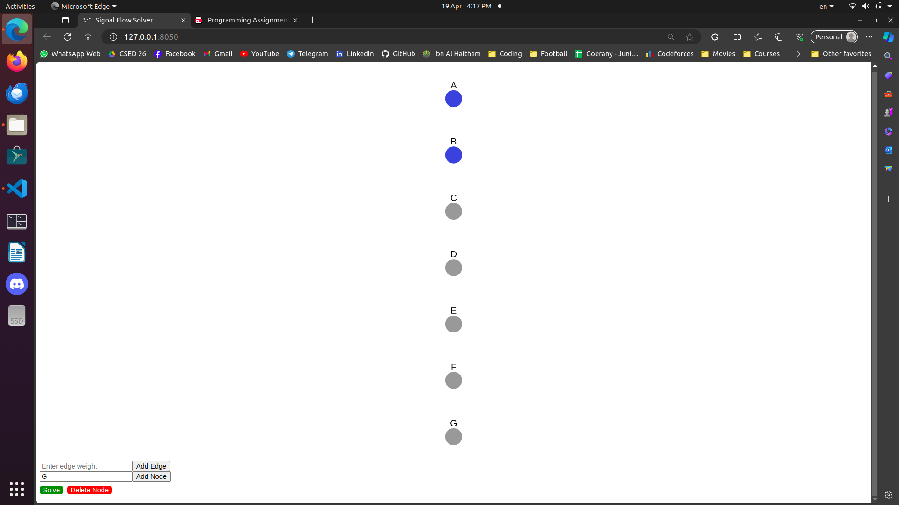
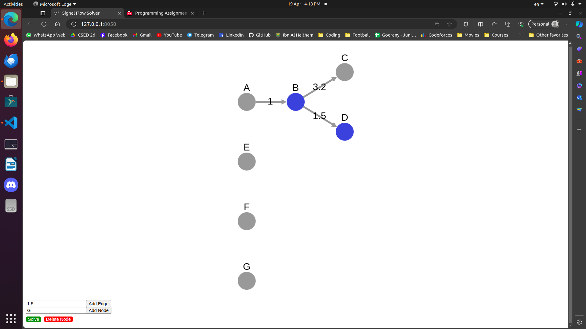
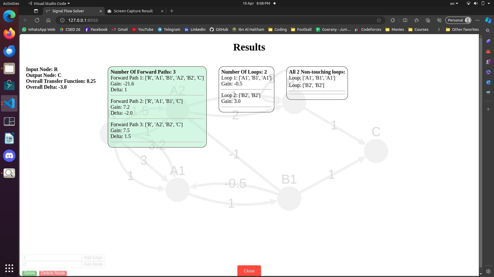

# Signal Flow Graph with GUI &amp; Routh-Hurwitz Stability Criterion
# 1 Signal Flow Graph
## Introduction

This Signal Flow Graph (SFG) program is designed to analyze and calculate various properties of a signal flow graph. It provides functionalities to find loops, forward paths, calculate gains, and determine the overall transfer function of the system represented by the graph. Its interactive graphical user interface (GUI) provides a platform to visualize and solve signal flow graphs. It enables users to dynamically create, modify, and freely move the graph, facilitating easy analysis of signal flow graphs.


## Program Features
- **Graphical Representation:** Visualize signal flow graphs using an interactive graph visualization tool. 
- **Add Nodes:** Dynamically add nodes with any unique name.
- **Add Edges:** Dynamically add edges (branches) with gain values.
- **Delete Nodes:** Remove all selected nodes from the graph along with their associated edges.
- **Solver:** Solve the drawn signal flow graph to obtain:
    - **Loop Analysis:**
        - Identify loops within the graph.
        - Calculate gains associated with each loop.
    - **Forward Path Analysis:**
        - Determine all possible forward paths.
        - Compute gains for each forward path.
        - Compute delta for each forward path. (Δ1, Δ2, ...., Δm) where m is the number of forward paths.
    - **Non-Touching Loop Analysis:**
        - Identify sets of all N combinations of non-touching loops.
        - Determine their respective gains.
    - **Input and Output Nodes:**
        - Find the input and output nodes of the system, computed through calculating indegrees and outdegrees of the graph nodes.
    - **Overall Delta Value (Δ):**
        - Calculate the overall delta (Δ) of the system.
    - **Overall Transfer Function:**
        - Calculate the overall transfer function of the system.

## Installation:
1. Clone this repository to your local machine:
    ```bash
    git clone https://github.com/ahmedyoussefg/SignalFlowGraph-And-Routh.git
    ```
2. Navigate to the project directory:

    ```bash
    cd SignalFlowGraph-And-Routh
    ```

3. Install the required dependencies:

    ```bash
    pip install -r requirements.txt
    ```
4. Run the application:

    ```bash
    python3 dash_interactive_gui.py
    ```

5. Access the application GUI by opening a web browser and navigating to `http://127.0.0.1:8050`.


# User Guide
- User guide video link (higher quality): https://drive.google.com/file/d/1YHF4xYRUhUy3GThPO1i_8fbL0PY5LGIC/view?usp=drive_link

### Selecting Nodes:
- Hold CTRL key while clicking on the nodes to select multiple nodes, press anywhere else to unselect all.
- You can also drag and move the nodes and the graph as much as you like.

  

### Adding Nodes and Edges:

- To add a node, enter the name of the node in the "Enter node name" field and click the "Add Node" button.
- To add an edge between two nodes, Enter the weight of the edge in the "Enter edge weight" field, then select the source node and while holding the CTRL key select the target node, then click the "Add Edge" button.

  

### Deleting Nodes:

- Select the node(s) you want to delete by first selecting them, then click the "Delete Node" button to remove the selected node(s) along with their associated edges.

### Solving the Graph:

- Once you have constructed the signal flow graph, click the "Solve" button to obtain the analysis results.
- The results will be displayed in the overlay container.
  

### Closing the Results Overlay:

- To close the results overlay and return to the graph view, click the "Close" button.

## Sample Runs:

#### Test Case #1:
  
 

#### Test Case #2:
  
  

#### Test Case #3: (Illustrating how we handle multi-edges)
  
  

#### Test Case #4:
  


## Data Structures Used

- **Graph Representation:** Signal flow graphs are represented using adjacency lists/dictionaries, where nodes are keys, and their outgoing edges are stored as lists of tuples containing target nodes and edge weights.

- **Path and Loop Storage:** Forward paths, loops, and non-touching loops are stored as lists of node sequences or sets of node sets, allowing for efficient traversal and analysis.
## Algorithms Used

- **Depth-First Search (DFS)**: Used not only to find loops in the graph but also to discover forward paths. DFS is applied recursively to traverse the graph, identifying cycles as loops and recording distinct paths from the input to the output nodes.
- **Combinations**: Utilized to find all combinations of non-touching loops.
- **Calculation of Gains and Delta**: Algorithms are implemented to calculate loop gains, forward path gains, and overall delta of the system.
- **Overall Transfer Function Calculation**: Mason's Gain Formula for calculating the overall transfer function of the system is implemented.

## Main Modules

- **SignalFlowGraph Class**: This class encapsulates all functionalities related to analyzing the signal flow graph. It includes methods for finding loops, forward paths, calculating gains, determining the overall transfer function and more.

## Technologies Used for GUI

- **Dash:** Python framework for building web applications.
- **Cytoscape:** JavaScript library for graph visualization.

## Assumptions

- There must be exactly one input node and exactly one output node in the signal flow graph.
- Multi-edges, representing multiple edges with the same direction between the same pair of nodes, are simplified into a single edge with the summation of all the multi-edges' gains when performing calculations.
- The input graph must be connected.
- Weights of the branch must be a number (floating or integer).